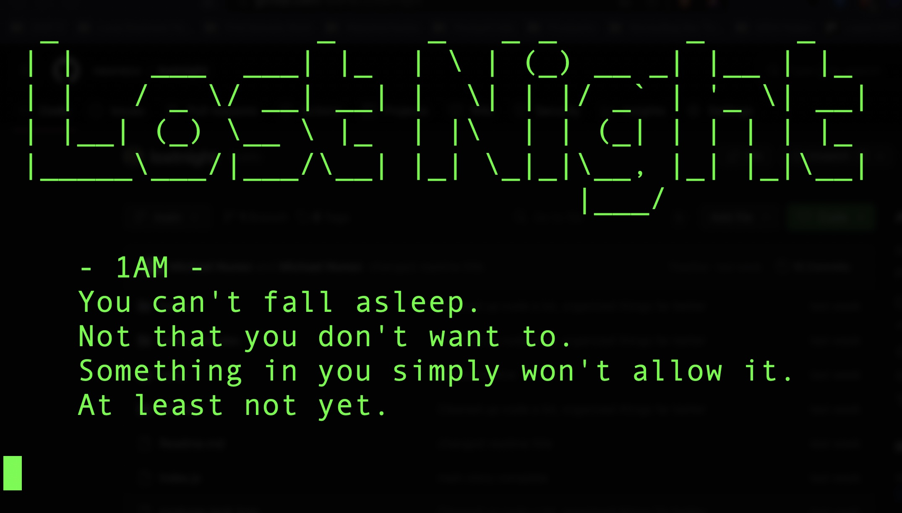

# Lost Night - Short Narrative PoC
<p align="center">
    
</p>

## Overview

This GitHub repository contains a narrative story implemented in Node.js. The story unfolds through a command-line interface, and the user makes decisions that affect the narrative progression. It's an engaging text-based adventure built with Node.js, making use of asynchronous functions and user input handling.

## Story Synopsis

The story begins at 1 AM when the protagonist finds themselves unable to sleep. A mysterious knock on the door disrupts their night, and the user must make choices that shape the narrative. The tension rises as the story unfolds, and decisions impact the outcome. Will you answer the door, facing the unknown, or ignore it, succumbing to fear?

## Project Structure

The project is organized into several components:

- **Utilities:** Contains helper functions like `displayTitle` and `getInput` to streamline the story implementation.
- **Story Parts:** Segments of the story are modularized in separate files (`partone`, `parttwo`, `partthree`, and `ending`) for clarity and maintainability.
- **Main Script:** The main script (`index.js`) orchestrates the flow of the story, invoking different parts asynchronously.

## How to Run

The easiest way to experience the short story is by using npx
```bash
npx lostnight
```

Otherwise, you can run it locally;

1. Clone the repository:

```bash
git clone https://github.com/newnezz/lostnight.git
```

2. Navigate to the project directory
```bash
cd lostnight
```

3. Install dependencies
```bash
npm install
```

4. Run the story
```bash
node index.js
```

Enjoy the narrative and make choices to see how the story unfolds!


## Contributing
If you're interested in contributing to the project or have suggestions for improvements, feel free to open issues or submit pull requests. Your input is highly appreciated!

## Author
Michael Nunez

## License
This project is licensed under the MIT License, so feel free to use, modify, and distribute it as needed.

